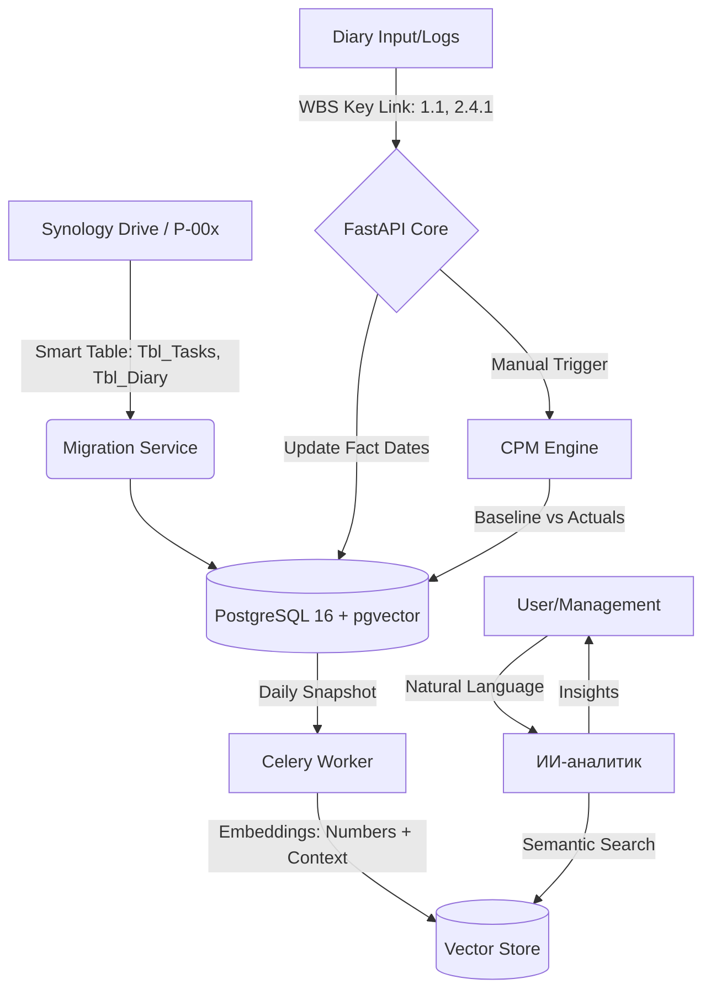

# Project-Chain (ProChain) ⛓️

**ProChain** — высокопроизводительная система управления портфелем проектов автоматизации. Полная миграция MVP из Excel/VBA в реактивную веб-среду с использованием метода критического пути (CPM), версионности планов (Baseline) и ИИ-аналитики.

## 🏗 Архитектура системы

### 1. Логическая схема процессов (Mermaid)

## 🚀 Ключевые бизнес-правила (MVP DNA)

### 1. Движок расчетов и Версионность (Baseline)
- **Baseline Logic:** Плановые даты из Excel (`Плановая дата начала/окончания`) фиксируются как **Базовый план**. Все изменения фиксируются в полях **Фактических дат**.
- **CPM Engine:** Расчет отклонений (финиш факта минус финиш плана). Ручной пересчет графа.
- **WBS-кодирование:** Использование иерархических ключей (`1.1`, `1.2.1`) для связи задач, дневников и логов дефектов.

### 2. Паспорт проекта и KPI
- **Единый Паспорт:** Объединение `Tbl_Min_Passport` и `Tbl_Project_Passport`.
- **Целевые метрики:** Контроль жестких KPI (Производительность 3750 дет/смену, КИМ 86.1%, Брак < 0.1%).
- **Smart Mapping:** Поиск таблиц по префиксам `Tbl_*` и автоматическое сопоставление синонимов заголовков (Этап = Задача).

### 3. Реактивные блокировки и Интерфейс
- **Data Lock:** Если заполнены «Фактические даты», поля «Плановых дат» блокируются.
- **UI Vibe:** Визуализация Ганта наследует цветовую схему Excel (План — Синий/Серый, Факт — Зеленый).
- **RACI:** Фильтрация задач по колонке "Ответственный" (ФИО из P-000).

## 🛠 Технологический стек
- **Backend:** FastAPI, SQLAlchemy 2.0.
- **Data:** PostgreSQL 16 (pgvector), Redis 7, Synology Drive API.
- **Frontend:** React, Tailwind CSS, SVAR Gantt (Custom Theme: Excel Style).
