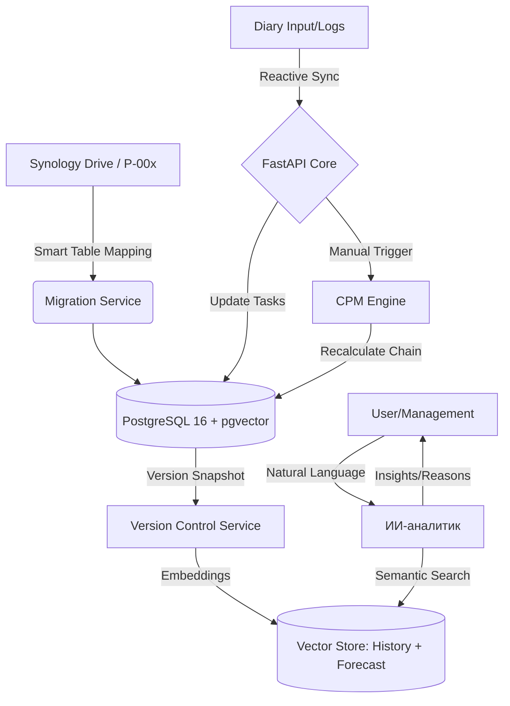

# Project-Chain (ProChain) ⛓️

**ProChain** — это высокопроизводительная система управления портфелем проектов автоматизации. Полная миграция MVP из Excel/VBA в реактивную веб-среду с использованием метода критического пути (CPM), версионности планов и ИИ-аналитики.

## 🏗 Архитектура системы

### 1. Логическая схема процессов (Mermaid)

## 🚀 Ключевые бизнес-правила (MVP DNA)

### 1. Движок расчетов и Версионность
- **Manual Trigger:** Расчет графа инициируется пользователем вручную.
- **Project Gantt (Individual):** В каждом паспорте проекта реализован собственный интерактивный Гантт, синхронизированный с метаданными этого проекта.
- **Versioning & Baselines:** Система поддерживает сохранение версий (снапшотов) Ганта. Это позволяет сравнивать текущее состояние с "Базовым планом" (Baseline) и видеть историю сдвигов.

### 2. Система идентификации и маппинга
- **Smart Migration:** Идентификация данных по алгоритму имен Умных таблиц (`Tbl_Project_*`, `Tbl_Tasks_*`).
- **Двухуровневый RACI:** Разделение ролей проекта (Куратор/Архитектор) и локальных исполнителей задач.
- **UX Reference:** Интерфейсы веб-приложения проектируются на основе "отрисованных интерфейсов" из Excel MVP для сохранения преемственности пользовательского опыта.

### 3. Реактивные блокировки (Data Integrity)
- **Data Lock:** Если по задаче зафиксирован факт (`hours_worked > 0`), поля планирования блокируются.
- **Live Lock:** Redis-блокировка ячеек (30 сек) + WebSocket трансляция.

### 4. ИИ-аналитика (History-Aware)
- **Контекстные снапшоты:** ИИ сопоставляет версии графиков и объясняет разницу между "Планом" и "Фактом" на основе текстовых записей в дневниках.

## 🛠 Технологический стек
- **Backend:** FastAPI, SQLAlchemy 2.0, Celery.
- **Data:** PostgreSQL 16, Redis 7, Synology Drive API.
- **Frontend:** React, Tailwind CSS, SVAR/DHTMLX Gantt (Прототип: UI из Excel MVP).

