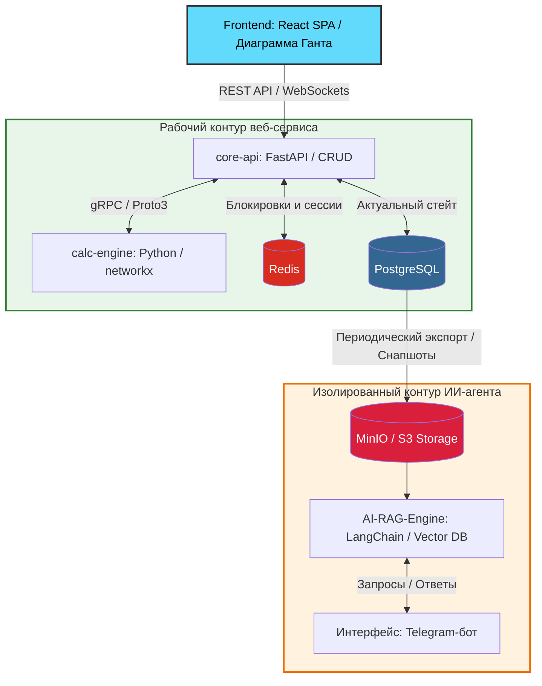

# 📊 Управление Портфелем Проектов (Project Portfolio Web)

Веб-сервис для централизованного управления портфелем проектов, контроля зависимостей задач и автоматического расчета критического пути. Система спроектирована как замена сложным Excel-MVP (`.xlsm` с макросами VBA) и оптимизирована для совместной работы в реальном времени.

---

## 🏗️ Общая архитектура системы (Data Flow)

Система построена на принципах **API-driven микросервисной архитектуры** в монорепозитории. Рабочая база данных веб-сервиса полностью изолирована от контура искусственного интеллекта.



---

## 🔒 Механизм реального времени: Пессимистическая блокировка (Locking)

Для полного исключения конфликтов и race conditions при одновременном редактировании на диаграмме Ганта используется жесткий принцип **«Один редактирует — остальные ждут»**.

### 🔄 Жизненный цикл блокировки задачи:

1. **Захват объекта:** Когда `Пользователь А` открывает карточку задачи или начинает Drag-and-Drop полоски на Ганте, фронтенд мгновенно отправляет по WebSockets событие:
   ```json
   { "action": "lock", "task_id": "uuid-123" }
   ```
2. **Запись в память:** `core-api` выполняет атомарную команду в Redis:
   ```redis
   SET lock:task:uuid-123 "user_a_id" NX EX 300
   ```
   * *`NX`* — гарантирует запись только в том случае, если задача свободна.
   * *`EX 300`* — таймаут на 5 минут. Если у пользователя пропадет интернет, блокировка снимется автоматически, задача не зависнет.
3. **Рассылка вещания (Broadcast):** Бэкенд рассылает всем участникам проекта событие `task_locked`. На фронтенде у `Пользователя Б` задача моментально становится серой (Read-Only) с индикатором *«Редактирует Иванов И.И.»*.
4. **Освобождение:** При нажатии «Сохранить» или «Отмена» ключ из Redis удаляется (`DEL`), а клиенты получают сигнал `task_unlocked` и свежий стейт данных.

---

## 🗄️ Слой хранения данных (Storage Layer)

### 🐘 PostgreSQL (Основная реляционная БД)
Содержит в себе всю бизнес-логику, структуру проектов и строгую историю изменений.

<details>
<summary><b>🗺️ Посмотреть ключевые таблицы и связи</b></summary>

*   **`users`**: `id (UUID)`, `email`, `password_hash`, `role` *(ADMIN, PORTFOLIO_MANAGER, PROJECT_MANAGER, USER, VIEWER)*.
*   **`projects`**: `id (UUID)`, `title`, `description`, `manager_id (FK)`, `status` *(ACTIVE, RISK, CRITICAL, COMPLETED)*, `created_at`, `updated_at`.
*   **`tasks`**: `id (UUID)`, `project_id (FK)`, `parent_id (FK, null для вех)`, `title`, `description`, `performer_id (FK)`, `start_date`, `end_date`, `status`, `progress (int)`, `is_critical_path (boolean)`, `updated_at`.
*   **`task_dependencies`**: `id (UUID)`, `parent_task_id (FK)`, `child_task_id (FK)`, `type` *(Finish-to-Start, Start-to-Start)*.
*   **`project_journals`** (Дневники проблем): `id (UUID)`, `project_id (FK)`, `task_id (FK, nullable)`, `author_id (FK)`, `text`, `created_at`.
*   **`audit_logs`**: `id (UUID)`, `user_id`, `action`, `entity_type`, `entity_id`, `changes (JSONB)` *(формат `{"field": {"old": x, "new": y}}`)*, `timestamp`.

</details>

### 🔴 Redis (In-Memory Key-Value)
*   Атомарные ключи блокировок задач в реальном времени: `lock:task:{task_id}`.
*   Кэширование тяжелых агрегированных данных для верхнеуровневых дашбордов (Dashboard) портфеля.
*   Менеджмент сессий и инвалидация JWT-токенов.

---

## ⚙️ Описание микросервисов бэкенда (Python / FastAPI)

### 1️⃣ Сервис `core-api` (Центральная бизнес-логика)
*   **WebSocket Manager:** Управляет пулом активных соединений с клиентами, обрабатывает экшены блокировки/разблокировки объектов через Redis.
*   **Excel Parser (Фоновый импорт):** На базе `openpyxl`. Обрабатывает входящие файлы `.xlsm` переходного периода. Если данные на сайте новее, чем в загружаемом файле (`updated_at`), строка из файла игнорируется, а событие улетает в системный лог синхронизации.
*   **Snapshot Service (Шлюз данных для ИИ):** По крону собирает данные из Postgres, очищает от технического мусора (миграции, токены) и генерирует структурированные JSON/Markdown карточки проектов. Файлы складываются в S3-бакет.

### 2️⃣ Сервис `calc-engine` (Математический движок графов)
*   Связывается с `core-api` через высокоскоростные бинарные контракты **gRPC (Proto3)**.
*   При любом изменении сроков или связей принимает массив зависимостей проекта и строит направленный ациклический граф (DAG) с помощью библиотеки **`networkx`**.
*   **Алгоритм CPM (Critical Path Method):** Производит прямой и обратный проход по графу, рассчитывая временные резервы задач (Total Float). Задачи с нулевым резервом помечаются как `is_critical_path = True` и возвращаются для подсветки на Ганте красным цветом.

---

## 🤖 Контур Искусственного Интеллекта (Изолированный RAG)

**Главный принцип интеграции ИИ: Полный запрет на сетевой доступ к PostgreSQL веб-сервиса.** 

*   **Источник данных:** ИИ-агент имеет доступ только к Read-Only бакету в **MinIO / S3**, куда `core-api` выгружает дистиллированные снапшоты. Это защищает основную БД от тяжелых аналитических нагрузок и исключает случайное удаление или модификацию данных роботом.
*   **Стек ИИ:** Python + LangChain / LlamaIndex + Собственная векторная база данных (pgvector / Chroma).
*   **Интерфейс (No UI):** ИИ-агент функционирует в виде **Telegram-бота**. Менеджер прямо с телефона может отправить текстовый или голосовой запрос: *«Сравни текущий статус проекта с прошлым месяцем. Из-за кого улетел критический путь по цеху?»*. ИИ делает семантический поиск по накопленной базе снапшотов («машине времени») и выдает выжимку.

---

## 📂 Структура репозитория

```text
Project-Portfolio/
├── docs/                  # Документация, схемы и техническое ТЗ
├── frontend/              # React SPA (Интерфейс, Гант, Zustand, WebSockets)
├── core-api/              # FastAPI: CRUD, Excel-парсер, WebSocket-менеджер блокировок
├── calc-engine/           # FastAPI / gRPC: Расчет критического пути (networkx)
├── proto/                 # gRPC контракты (.proto файлы)
└── docker-compose.yml     # Оркестрация инфраструктуры (Postgres, Redis, MinIO)
```
