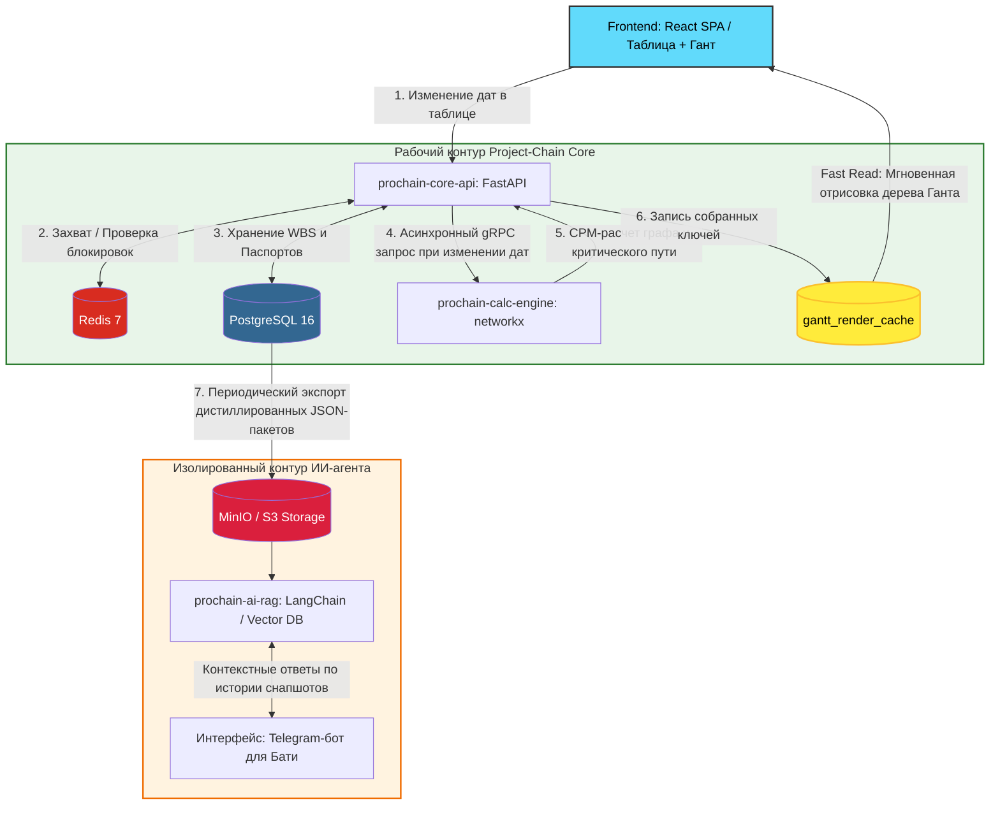

# 📊 Project-Chain (ProChain): Система Управления Портфелем Проектов

**Project-Chain** — высокопроизводительный веб-сервис для централизованного контроля портфеля проектов автоматизации фабрики, управления логическими зависимостями и предрасчета критического пути. 

Система разработана для миграции данных из локальных папок MVP-архива (содержащих файлы `Проект Р-ХХХ.xlsx` и `РХХХ Дневник.xlsx`) в единую веб-среду, оптимизированную для менеджмента и последующего анализа ИИ-агентом.

---

## 🏗️ Архитектура системы & Кэширование данных (Data Flow)

Главный инженерный принцип системы: **Нулевой расчет на лету при построении диаграммы Ганта**. График справа — это Read-Only рендер, который мгновенно отрисовывается из предварительно собранных ключей и дерева связей, хранящихся в кэше базы данных.



---

## 🔒 UX-Взаимодействие: Табличная правка и Живые Блокировки

Диаграмма Ганта справа является нередактируемой (Read-Only). Изменение любых плановых/фактических сроков, длительностей и ответственных происходит исключительно через инлайн-редактирование ячеек в табличной части слева. 

### 🔄 Жизненный цикл блокировки строки и перерисовки Ганта:

1. **Захват ячейки:** Когда `Пользователь А` дважды кликает на ячейку даты или прогресса задачи в левой части экрана, фронтенд шлет в WebSocket сигнал:
   ```json
   { "action": "lock", "task_id": "task-uuid-123" }
   ```
2. **Атомарный лок в оперативной памяти:** Сервис `prochain-core-api` резервирует строку в Redis:
   ```redis
   SET lock:task:task-uuid-123 "user_a_id" NX EX 300
   ```
3. **Блокировка у остальных:** Всем активным пользователям проекта улетает WebSocket-событие `task_locked`. У `Пользователя Б` вся строка в таблице и полоса на Ганте моментально окрашиваются в матово-серый цвет 🔒 с подсказкой *«Редактирует Климов А.Н.»*.
4. **Сохранение и пересчет:** `Пользователь А` нажимает `Enter`. `core-api` записывает дату в Postgres и асинхронно дергает `calc-engine` по gRPC. Движок на базе `networkx` пересчитывает граф связей, определяет сдвиги зависимых задач и обновляет таблицу кэша `gantt_render_cache`.
5. **Мгновенное обновление экрана:** Модуль очищает ключ блокировки в Redis. Все пользователи получают WebSocket-сигнал `task_unlocked` вместе с обновленным JSON-деревом кэша. Полоски Ганта на экранах всех участников плавно перерисовываются под новые даты без перезагрузки страницы.

---

## 🗄️ Реляционная структура данных (Storage Layer)

Схема таблиц в PostgreSQL адаптирована под структуру папок архива и обеспечивает сборку ключей на этапе импорта.

### 📁 Маппинг бандлов папок проектов:
*   Файлы **`Проект Р-ХХХ.xlsx`** (Листы: *Минимальный паспорт, Паспорт проекта, План-график*) \(\rightarrow\) таблицы `projects` и `tasks`.
*   Файлы **`РХХХ Дневник.xlsx`** (Листы: *Дневник реализации, Протокол встречи*) \(\rightarrow\) таблица `project_journals`.

<details>
<summary><b>🗺️ Схема ключевых таблиц PostgreSQL</b></summary>

```sql
CREATE TABLE projects (
    id UUID PRIMARY KEY DEFAULT gen_random_uuid(),
    project_code VARCHAR(50) UNIQUE NOT NULL, 
    title VARCHAR(255) NOT NULL,              
    description TEXT,                          
    business_problem TEXT,                 
    target_goal TEXT,                      
    expected_result TEXT,                  
    stage VARCHAR(100),                       
    mgmt_status VARCHAR(100),                 
    updated_at TIMESTAMP WITH TIME ZONE DEFAULT CURRENT_TIMESTAMP
);

CREATE TABLE tasks (
    id UUID PRIMARY KEY DEFAULT gen_random_uuid(),
    project_id UUID REFERENCES projects(id) ON DELETE CASCADE,
    wbs_code VARCHAR(50) NOT NULL,            
    phase VARCHAR(100),                       
    title VARCHAR(255) NOT NULL,              
    description TEXT,
    expected_result TEXT,
    responsible VARCHAR(255),                 
    resources TEXT,                           
    plan_start_date DATE,
    plan_duration_days INT,
    plan_end_date DATE,
    fact_start_date DATE,
    fact_duration_days INT,
    fact_end_date DATE,
    status VARCHAR(50),                       
    progress_percent INT DEFAULT 0,
    updated_at TIMESTAMP WITH TIME ZONE DEFAULT CURRENT_TIMESTAMP
);

CREATE TABLE project_journals (
    id UUID PRIMARY KEY DEFAULT gen_random_uuid(),
    project_id UUID REFERENCES projects(id) ON DELETE CASCADE,
    wbs_code VARCHAR(50),                     
    category CHAR(1),                         
    event_date DATE,
    location_zone VARCHAR(255),               
    task_title TEXT,                          
    physical_action TEXT,                     
    business_reason TEXT,                     
    responsible VARCHAR(255),
    deadline DATE,
    status VARCHAR(100),                      
    source_origin VARCHAR(255)                
);

CREATE TABLE gantt_render_cache (
    project_id UUID PRIMARY KEY REFERENCES projects(id) ON DELETE CASCADE,
    wbs_tree_json JSONB NOT NULL,             
    gantt_timeline_json JSONB NOT NULL,       
    critical_path_keys TEXT[],                
    updated_at TIMESTAMP WITH TIME ZONE DEFAULT CURRENT_TIMESTAMP
);
```

</details>

---

## ⚙️ Функционал микросервисов бэкенда (Python / FastAPI)

### 1️⃣ Сервис `prochain-core-api`
*   **Сборщик ключей и Кэш-Менеджер:** При открытии проекта фронтендом вычитывает предрассчитанные JSONB-структуры из таблицы `gantt_render_cache`, обеспечивая загрузку экрана за доли секунды.
*   **WebSocket Стейт-Машина:** Отвечает за контроль пула активных пользователей и атомарный захват ячеек в Redis при инлайн-редактировании.
*   **Фоновый архивный парсер:** На базе `openpyxl`. Обрабатывает ручную загрузку папок с проектами. Сверяет `updated_at`. Если данные на сайте новее — запись из файла пропускается, а событие фиксируется в системных логах синхронизации.

### 2️⃣ Сервис `prochain-calc-engine`
*   Изолированный математический сервис на Python. Взаимодействует с `core-api` через быстрые **gRPC**-контракты.
*   При триггере обновления дат в таблице принимает плоский массив связей, строит направленный ациклический граф (DAG) проекта в библиотеке **`networkx`**.
*   **Алгоритм CPM (Critical Path Method):** Просчитывает временные резервы (Total Float). Задачи с нулевым резервом помечаются флагом критического пути, сервис собирает новое дерево отображения и перезаписывает `gantt_render_cache`.

---

## 🤖 Контур Искусственного Интеллекта (Изолированный RAG)

**ИИ-агент полностью отрезан от сетевого доступа к PostgreSQL рабочего веб-сервиса.** 

*   **Конвейер данных:** По расписанию или кнопке `Snapshot Service` внутри `core-api` выгружает дистиллированные, очищенные от технической инфы JSON-пакеты (карточки проектов со всей хронологией дневников и критических путей) в закрытый бакет **MinIO / S3**.
*   **Логика RAG:** Сервис `prochain-ai-rag` (LangChain + Vector DB) индексирует эти файлы. 
*   **Интерфейс Бати (No UI):** Доступ к ИИ-аналитике реализован исключительно через **Telegram-бота**. Батя прямо с телефона может наговорить голосом: *«Посмотри дневники по Липецку за прошлую неделю и скажи, какие технические проблемы сдвинули критический путь?»*. ИИ делает семантический поиск по накопленным снапшотам, сопоставляет физические действия из дневника и выдает емкую выжимку.

---

## 📂 Структура репозитория

```text
ProChain/
├── docs/                  # Системная документация, схемы данных и ТЗ
├── frontend/              # React SPA (Таблица, Read-Only Гант, Zustand, WebSockets)
├── core-api/              # FastAPI: Менеджер кэша Ганта, Excel-парсер, WebSocket-сервис locks
├── calc-engine/           # FastAPI / gRPC: Математический расчет графов на networkx
├── proto/                 # Контракты межсервисного взаимодействия (.proto файлы)
└── docker-compose.yml     # Скрипт развертывания инфраструктуры (Postgres, Redis, MinIO)
```
