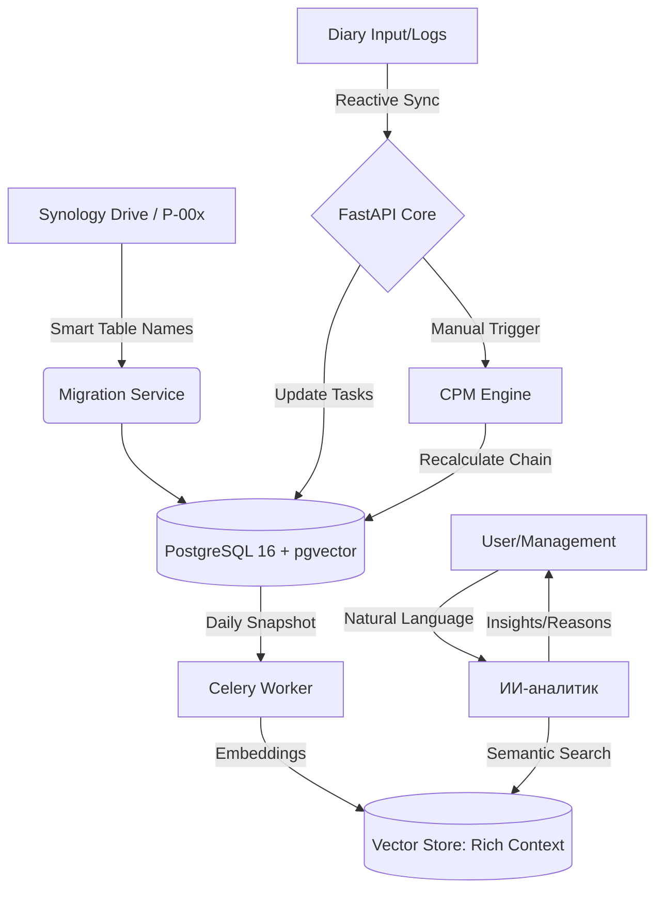

# Project-Chain (ProChain) ⛓️

**ProChain** — это высокопроизводительная веб-система управления портфелем проектов автоматизации. Полная миграция экосистемы Excel/VBA MVP в промышленную архитектуру с использованием метода критического пути (CPM) и контекстной ИИ-аналитики.

## 🏗 Архитектура системы

### 1. Логическая схема процессов (Mermaid)


### 2. Сводная структура папок репозитория
```text
project-chain/
├── backend/                # FastAPI (Core, CPM Engine, AI Services)
├── frontend/               # React (Gantt, Management Dashboard, Diary)
├── parser/                 # Smart Migration Tool (Excel Tables -> DB)
├── ai_agent/               # LangChain & Vector Search (Rich Snapshots)
├── docker-compose.yml      # Infra: Postgres, Redis, RabbitMQ, pgvector, Synology API
└── data_archive/           # Входящие проекты из Synology Drive
```

## 🚀 Ключевые бизнес-правила (MVP DNA)

### 1. Движок расчетов (CPM Engine)
- **Manual Trigger:** Пересчет резервов и сдвиг цепочек задач инициируется пользователем вручную (кнопка «Пересчитать граф»).
- **Логика Вехи (MS):** `duration = 0`. Веха является самостоятельным объектом с собственными фиксированными датами старта/финиша.
- **Calendar:** Кастомная функция `get_next_working_day` (пропуск выходных и праздников).

### 2. Система идентификации и маппинга
- **Умная миграция:** Идентификация данных производится на основе **алгоритма имен «Умных таблиц»** (ListObjects: `Tbl_Project_*`, `Tbl_Tasks_*` и др.).
- **Двухуровневый RACI:** Разделение глобальных ролей проекта (Заказчик/Куратор) и локальных исполнителей конкретных задач в Ганте.
- **Единый Паспорт:** Автоматическое объединение данных из "Минимального паспорта" и "Паспорта проекта" в единую валидную модель.

### 3. Реактивные блокировки (Data Integrity)
- **Data Lock:** Если по задаче зафиксирован факт (`hours_worked > 0`), поля планирования (старт, связи) блокируются.
- **Live Lock:** Использование Redis + WebSockets для блокировки ячеек при одновременном редактировании.

### 4. Контекстная ИИ-аналитика
- **Rich Snapshots:** ИИ анализирует "полную картину" — сопоставление текстовых логов дневника с числовыми метриками прогресса и изменениями дат CPM.

## 🛠 Технологический стек
- **Backend:** FastAPI, SQLAlchemy 2.0, Celery.
- **Data:** PostgreSQL 16, Redis 7, **Synology Drive API**.
- **Frontend:** React, Tailwind CSS, SVAR/DHTMLX Gantt.
```

---
