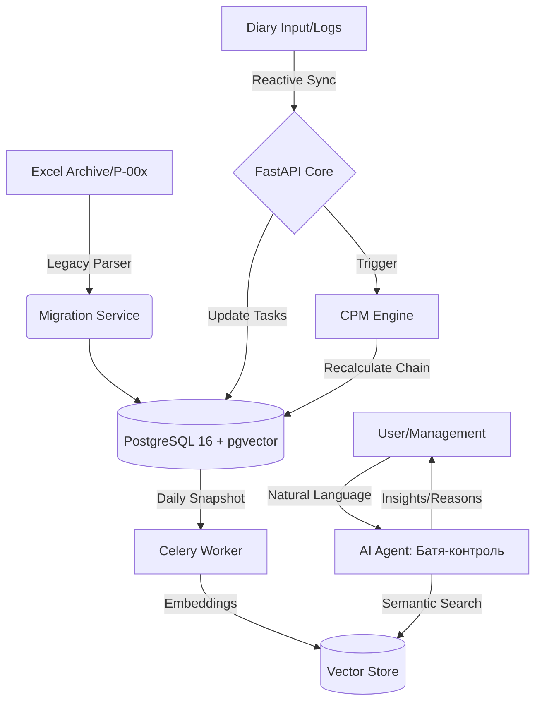
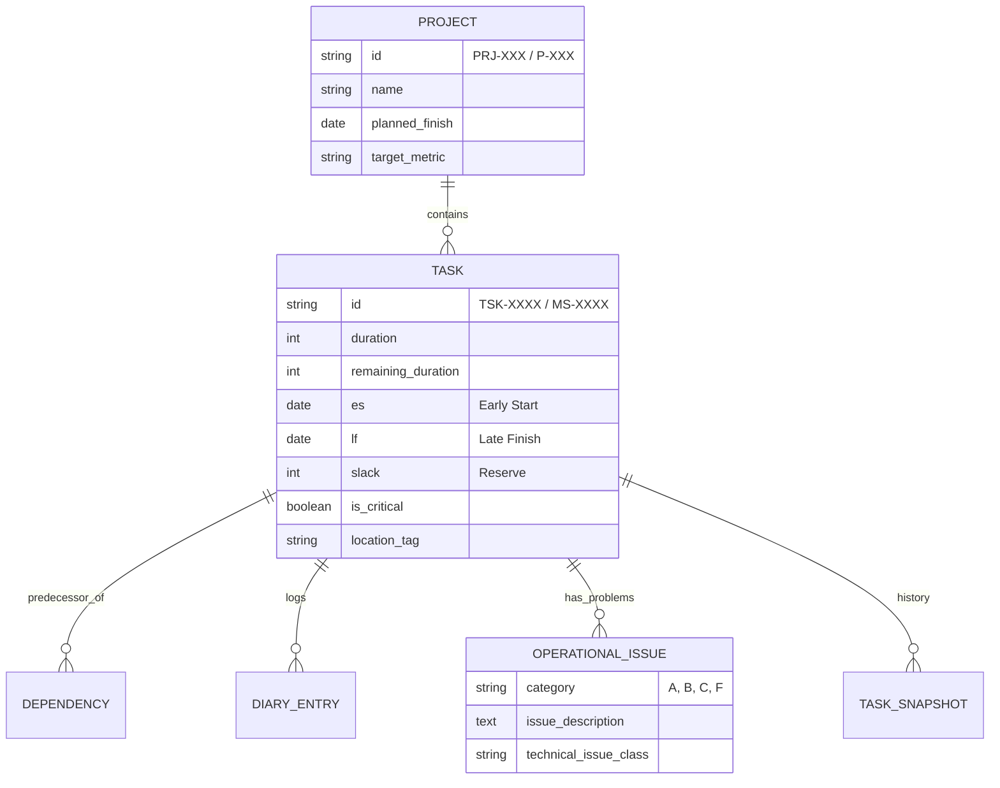

# Project-Chain (ProChain) ⛓️

**ProChain** — это высокопроизводительная система управления портфелем проектов автоматизации. Система представляет собой полную миграцию сложной экосистемы Excel/VBA MVP в реактивную веб-среду с использованием математической модели сетевого планирования (CPM) и ИИ-аналитики.

## 🏗 Архитектура системы

### 1. Логическая схема процессов (Mermaid)


### 2. Реляционная структура данных (ER Diagram)


## 📂 Структура репозитория
```text
project-chain/
├── backend/                # Python / FastAPI
│   ├── app/
│   │   ├── api/            # Эндпоинты (Gantt, Diary, Analytics)
│   │   ├── core/           # Движок CPM и производственный календарь
│   │   ├── models/         # Модели SQLAlchemy (Валидация ID через Regex)
│   │   ├── services/       # AI Агент и логика снапшотов
│   │   └── crud/           # Логика блокировок и CRUD
│   ├── parser/             # Инструмент миграции из ProjectArchive
│   └── alembic/            # Миграции базы данных
├── frontend/               # React / TypeScript
│   ├── src/
│   │   ├── components/     # Интерактивный Гантт, Формы дневников
│   │   ├── hooks/          # WebSocket (Live Cell Locking)
│   │   └── store/          # Состояние (Zustand)
├── ai_agent/               # Логика LangChain и векторный поиск
├── docker-compose.yml      # Infra: Postgres, Redis, RabbitMQ, pgvector
└── data_archive/           # Входящие данные (Excel/XLSM)
```

## 🚀 Ключевые бизнес-правила (MVP DNA)

### 1. Движок расчетов (CPM Engine)
- **Алгоритм:** Полная реализация Forward/Backward Pass. Определение критического пути (Slack = 0).
- **Производственный календарь:** Кастомная функция `get_next_working_day`. Пропуск выходных и праздников из `holiday_calendar`.
- **Вехи (Milestones):** Задачи с `duration = 0`. Дата вехи привязана к финишу предшествующей цепочки.

### 2. Система идентификации и связей
- **Жесткие ключи:** 
    - Проекты: `^PRJ-[0-9]{3}$`
    - Задачи: `^TSK-[0-9]{4}$`
    - Вехи: `^MS-[0-9]{4}$`
- **Integrity:** Связь данных в Ганте и Дневниках идет исключительно по ID. Текстовое переименование задачи не разрывает связь.

### 3. Реактивные блокировки (Data Integrity)
- **Data Lock:** Если в `diary_entries` или `operational_issues` по задаче зафиксирован факт (`hours_worked > 0`), поля `planned_start` и `dependencies` в Ганте блокируются для ручного изменения.
- **Live Lock (UX):** Использование Redis + WebSockets для блокировки ячейки при редактировании ("Живой курсор").

### 4. Интеллектуальный слой
- **Снапшоты:** Ежедневная агрегация текстовых данных в таблицу `task_snapshots`.
- **Семантический поиск:** ИИ анализирует поле `aggregated_comments` (`[Дата][Локация][Проблема][Текст]`).
- **Кейс:** Поиск по запросу "проблемы с датчиками в Липецке" выдает исторические причины сдвига критического пути.

## 📁 Спецификация импорта Legacy данных
- **Архив:** `ProjectArchive_20260828_134022`.
- **Маппинг:**
    - `План-график*.xlsx` → `portfolio_tasks`.
    - `Дневник*.xlsx` → `operational_issues` и `diary_entries`.
    - `鐵__1.0.14h.xlsm` → Извлечение `queryTable.xml` (кэши Power Query) в кодировке `gbk` для наполнения исторической базы.

## 🛠 Технологический стек
- **Backend:** FastAPI, SQLAlchemy 2.0, Celery.
- **Data:** PostgreSQL 16 (pgvector), Redis 7.
- **Frontend:** React, Tailwind CSS, SVAR/DHTMLX Gantt.
- **AI:** LangChain, OpenAI API / DeepSeek.
