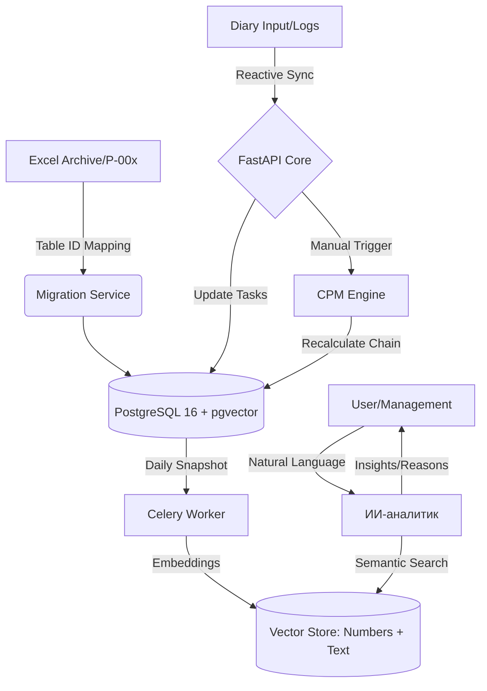
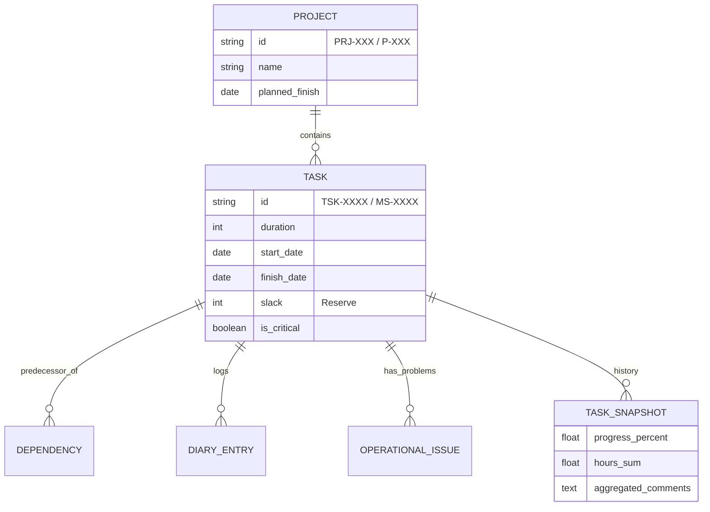

# Project-Chain (ProChain) ⛓️

**ProChain** — это высокопроизводительная система управления портфелем проектов автоматизации. Система представляет собой полную миграцию сложной экосистемы Excel/VBA MVP в реактивную веб-среду с использованием математической модели сетевого планирования (CPM) и ИИ-аналитики.

## 🏗 Архитектура системы

### 1. Логическая схема процессов (Mermaid)


### 2. Реляционная структура данных (ER Diagram)


## 📂 Структура репозитория
```text
project-chain/
├── backend/                # Python / FastAPI
│   ├── app/
│   │   ├── api/            # Эндпоинты (Gantt, Diary, Analytics)
│   │   ├── core/           # Движок CPM и производственный календарь
│   │   ├── models/         # Модели SQLAlchemy (Валидация ID через Regex)
│   │   ├── services/       # ИИ-сервисы и логика снапшотов
│   │   └── crud/           # Логика блокировок и CRUD
│   ├── parser/             # Инструмент миграции (Поиск по Table ID)
│   └── alembic/            # Миграции базы данных
├── frontend/               # React / TypeScript
│   ├── src/
│   │   ├── components/     # Интерактивный Гантт, Формы дневников
│   │   ├── hooks/          # WebSocket (Live Cell Locking)
│   │   └── store/          # Состояние (Zustand)
├── ai_agent/               # Логика векторного поиска (Numbers + Text)
├── docker-compose.yml      # Infra: Postgres, Redis, RabbitMQ, pgvector
└── data_archive/           # Входящие данные (Excel/XLSM)
```

## 🚀 Ключевые бизнес-правила (MVP DNA)

### 1. Движок расчетов (CPM Engine)
- **Алгоритм:** Реализация Forward/Backward Pass. Определение критического пути (Slack = 0).
- **Ручной триггер:** Расчет резервов и сдвиг цепочек задач инициируется пользователем вручную (кнопка «Пересчитать»).
- **Логика Вехи (MS):** `duration = 0`. Каждая веха имеет собственные атрибуты `start_date` и `finish_date`. Веха является самостоятельным контрольным объектом в графе зависимостей.
- **Производственный календарь:** Кастомная функция `get_next_working_day`. Пропуск выходных и праздников из `holiday_calendar`.

### 2. Система идентификации и связей
- **Жесткие ключи:** Проекты (`PRJ-XXX`), Задачи (`TSK-XXXX`), Вехи (`MS-XXXX`).
- **Integrity:** Связь данных в Ганте и Дневниках идет исключительно по ID.
- **Маппинг импорта:** Идентификация данных производится строго по системным ID умных таблиц Excel (table1–table34), что исключает ошибки при переименовании листов.

### 3. Реактивные блокировки (Data Integrity)
- **Data Lock:** Если по задаче зафиксирован факт (`hours_worked > 0`), поля `planned_start` и `dependencies` в Ганте блокируются для изменения.
- **Live Lock (UX):** Использование Redis + WebSockets для блокировки ячейки при редактировании ("Живой курсор").

### 4. ИИ-аналитика (Семантический поиск)
- **Контекстные снапшоты:** Система предоставляет ИИ «полную картину»: сопоставление текстовых логов с числовыми метриками прогресса (часы, %) и изменениями дат.
- **Функционал:** Ответы на запросы о причинах задержек на основе сопоставления текста дневников со сроками задач. Обработка текстовых и голосовых команд.

## 📁 Спецификация импорта Legacy данных
- **Архив:** `ProjectArchive_20260828_134022`.
- **Маппинг:** Таблицы планов-графиков → `portfolio_tasks`, таблицы дневников реализации → `operational_issues` и `diary_entries` (на основе Table ID).
- **Legacy Core:** Извлечение 11-ти структур `queryTable.xml` из ядра `鐵__1.0.14h.xlsm` в кодировке `gbk` для формирования исторической базы.

## 🛠 Технологический стек
- **Backend:** FastAPI, SQLAlchemy 2.0, Celery.
- **Data:** PostgreSQL 16 (pgvector), Redis 7.
- **Frontend:** React, Tailwind CSS, SVAR/DHTMLX Gantt.
- **AI:** LangChain, OpenAI API / DeepSeek.
- **Storage:** S3-совместимое хранилище (MinIO/AWS) для хранения оригиналов Excel-файлов и вложений из дневников.
